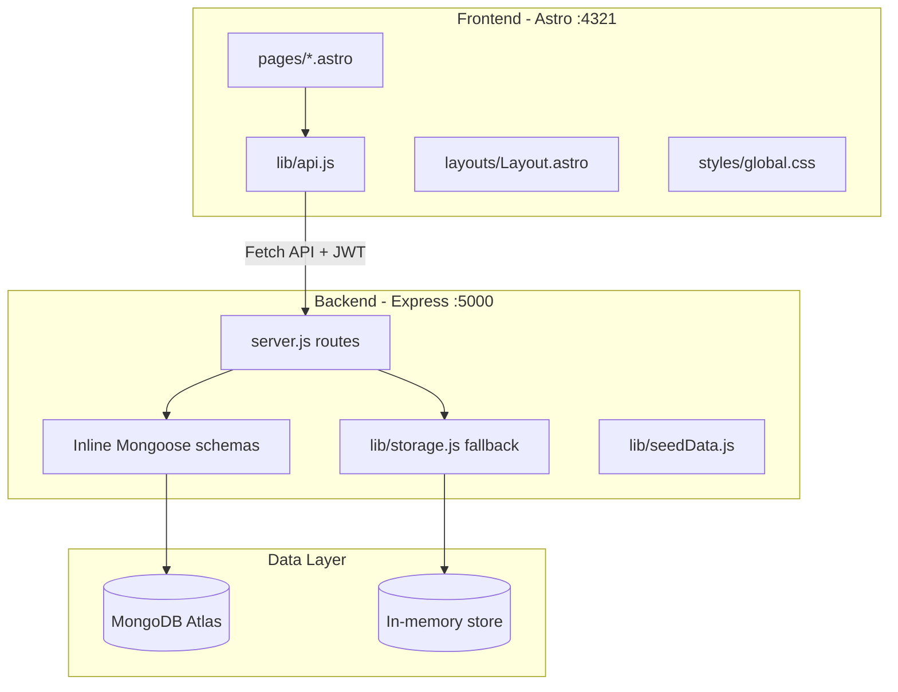
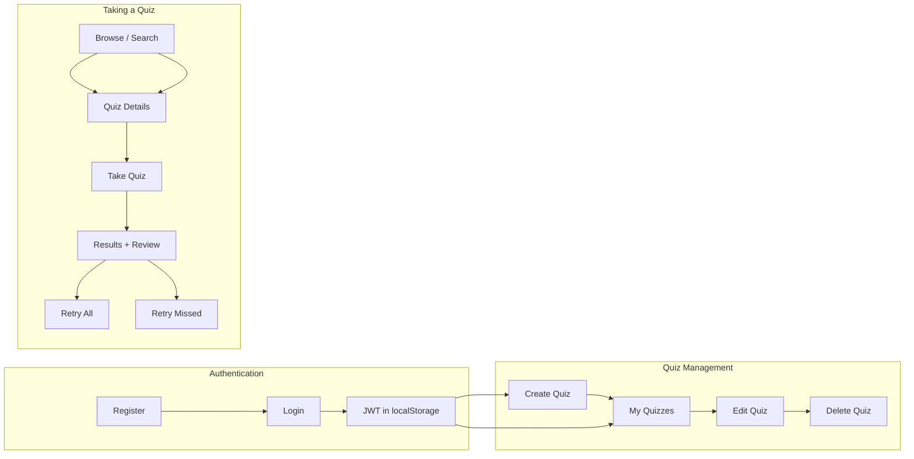

# JS Quizlet — Project Structure

A full-stack JavaScript quiz application for beginner and intermediate learners. Users browse and search quizzes, create and manage their own quiz sets, take quizzes, view scores, review answers, and retake quizzes.

**Team:** Avery Jones, Enoch Olayemi, Boston Wyatt, Christian Haroldsen

---

## Architecture Overview

The app is split into a **frontend website** (Astro) and a **REST API** (Express). The frontend talks to the API over HTTP using the Fetch API and JWT authentication.



### Request flow

1. User visits a page under `frontend/src/pages/` (Astro file-based routing).
2. Page scripts call helpers in `frontend/src/lib/api.js`.
3. `api.js` sends requests to the Express server (default `http://localhost:5000`).
4. The server reads/writes data in **MongoDB Atlas** when `MONGODB_URI` is set, or falls back to an **in-memory store** for local development.

---

## Directory Structure

```text
js-quizlet/
├── README.md                    # Project spec, API docs, sprint plan
├── docs/
│   └── PROJECT_STRUCTURE.md     # This file — architecture and page map
│
├── frontend/                    # User-facing website (Astro)
│   ├── astro.config.mjs         # Astro + Svelte integration config
│   ├── public/                  # Static assets (favicon)
│   └── src/
│       ├── pages/               # File-based routes = website pages
│       │   ├── index.astro          → Home (/)
│       │   ├── quizzes.astro        → Browse & Search (/quizzes)
│       │   ├── quizzes/[id].astro   → Quiz Details (/quizzes/:id)
│       │   ├── take/[id].astro      → Quiz Taking (/take/:id)
│       │   ├── results.astro        → Quiz Results + Review (/results?quiz=:id)
│       │   ├── dashboard.astro      → My Quizzes (/dashboard)
│       │   ├── create.astro         → Create Quiz (/create)
│       │   ├── edit/[id].astro      → Edit Quiz (/edit/:id)
│       │   ├── login.astro          → Login (/login)
│       │   ├── register.astro       → Register (/register)
│       │   └── 404.astro            → Error / 404
│       ├── layouts/
│       │   └── Layout.astro     # Shared HTML shell + Navbar
│       ├── components/
│       │   ├── Navbar.astro     # Auth-aware navigation
│       │   └── QuizCard.astro   # Reusable quiz card component
│       ├── lib/
│       │   └── api.js           # Fetch wrapper, JWT session, CRUD helpers
│       └── styles/
│           └── global.css       # Global layout + responsive styles
│
├── server/                      # REST API (Express + MongoDB)
│   ├── src/
│   │   ├── server.js            # App entry, auth, quiz CRUD, schemas
│   │   ├── lib/
│   │   │   ├── storage.js       # In-memory fallback when no MongoDB
│   │   │   ├── seed.js          # Demo user + quiz seed builder
│   │   │   └── seedData.js      # Reset + load seed data
│   │   ├── services/
│   │   │   └── contentTransformService.js  # Seed quiz content from topic catalog
│   │   └── models/
│   │       └── User.js          # Alternate User model (not used by server.js)
│   └── test/
│       └── auth.test.js         # Basic auth smoke test
│
└── backend/                     # Legacy prototype server (not used by frontend)
    └── server.js
```

---

## Frontend Pages (Wireframe Map)

Astro maps each file in `frontend/src/pages/` to a URL route.

| Wireframe | URL | Source file | Purpose |
|-----------|-----|-------------|---------|
| Home | `/` | `index.astro` | Landing page with featured quizzes |
| Browse / Search | `/quizzes` | `quizzes.astro` | List and search public quizzes |
| Quiz Details | `/quizzes/:id` | `quizzes/[id].astro` | View quiz info before taking it |
| Quiz Taking | `/take/:id` | `take/[id].astro` | Answer questions with optional immediate feedback |
| Quiz Results | `/results?quiz=:id` | `results.astro` | Score summary after completing a quiz |
| Review Answers | (merged into Results) | `results.astro` | Per-question answer review on results page |
| My Quizzes | `/dashboard` | `dashboard.astro` | List quizzes owned by the logged-in user |
| Create Quiz | `/create` | `create.astro` | Build a new quiz with MC and true/false questions |
| Edit Quiz | `/edit/:id` | `edit/[id].astro` | Update or delete an owned quiz |
| Login | `/login` | `login.astro` | Sign in with email and password |
| Register | `/register` | `register.astro` | Create a new account |
| Profile / Settings | — | *(not yet built)* | Planned user profile page |
| Delete Confirmation | inline dialog | `dashboard.astro`, `edit/[id].astro` | Browser `confirm()` before delete |
| Error / 404 | any unknown route | `404.astro` | Not-found page |

### Shared frontend files

| File | Role |
|------|------|
| `layouts/Layout.astro` | Wraps every page with HTML head, global CSS, and navbar |
| `components/Navbar.astro` | Site navigation; shows login/logout based on auth state |
| `lib/api.js` | Central API client — auth, quiz CRUD, search, seed |
| `styles/global.css` | Layout, cards, buttons, badges, responsive breakpoints |

---

## Backend Structure

The primary API lives in `server/src/server.js`. Run it with:

```bash
cd server
npm install
npm start
```

Default port: **5000**

### API endpoints

| Method | Endpoint | Auth | Description |
|--------|----------|------|-------------|
| `GET` | `/api/health` | No | Health check |
| `POST` | `/api/seed` | No | Reset and load demo data |
| `POST` | `/api/auth/register` | No | Register (`username`, `email`, `password`) |
| `POST` | `/api/auth/login` | No | Log in and receive JWT |
| `GET` | `/api/auth/me` | Yes | Get current user from JWT |
| `GET` | `/api/quizzes` | No* | List public quizzes; `?search=term` to filter |
| `GET` | `/api/quizzes?owner=me` | Yes | List quizzes owned by current user |
| `GET` | `/api/quizzes/:id` | No | Get one quiz by ID |
| `POST` | `/api/quizzes` | Yes | Create a quiz |
| `PUT` | `/api/quizzes/:id` | Yes | Update an owned quiz |
| `DELETE` | `/api/quizzes/:id` | Yes | Delete an owned quiz |

\* `?owner=me` requires authentication.

### Database models

Schemas are defined inline in `server/src/server.js`:

**User**
- `username`, `email`, `passwordHash`, timestamps

**Quiz**
- `title`, `description`, `topic`, `difficulty`, `ownerId`, `isPublic`, `questions[]`, timestamps

**Question** (embedded in Quiz)
- `questionText`, `questionType` (`multipleChoice` | `trueFalse`), `choices[]`, `explanation`

**Choice** (embedded in Question)
- `text`, `isCorrect`

When MongoDB is unavailable, `server/src/lib/storage.js` holds users and quizzes in memory and auto-seeds on startup.

---

## Key User Flows



---

## Tech Stack

| Layer | Technologies |
|-------|--------------|
| Frontend | HTML, CSS, Vanilla JavaScript, Astro, Fetch API |
| Backend | Node.js, Express.js, Mongoose |
| Database | MongoDB Atlas (with in-memory fallback) |
| Tooling | Git, GitHub, Trello, Netlify (deployment) |

---

## Local Development

**Frontend** (port 4321):

```bash
cd frontend
npm install
npm run dev
```

**Backend** (port 5000):

```bash
cd server
npm install
npm start
```

Set `PUBLIC_API_URL` in the frontend environment if the API is not on `localhost:5000`.

Set `MONGODB_URI` in the server environment to use MongoDB Atlas instead of the in-memory store.

---

## Notes

- The active stack is **`frontend/` + `server/`**. The `backend/` folder is an older prototype and is not used by the current frontend.
- The leftover Vite/Svelte scaffold (`frontend/index.html`, `src/main.js`, `src/App.svelte`, `src/app.css`, `src/components/QuizApp.svelte`) has been removed so the frontend is purely Astro.
- Dynamic quiz routes (`quizzes/[id]`, `take/[id]`, `edit/[id]`) currently pre-render IDs 1–20 via `getStaticPaths()`.
